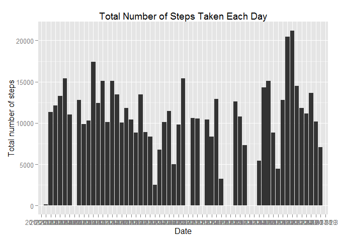

# Reproducible Research: Peer Assessment 1
Created by fourlin88, 11 June 2015

### Loading and preprocessing the data

Here is the code to

1. Load the data (i.e. `read.csv()`)

2. Process/transform the data into a format suitable for analysis


```r
library(plyr)
unzip("activity.zip")
Data<-read.csv("activity.csv")
DataGroupedByDate <- ddply(Data, c("date"), summarise,
               sum = sum(steps)
)
```

### What is mean total number of steps taken per day?

For this part of the assignment, we can ignore the missing values in
the dataset.

1. Make a histogram of the total number of steps taken each day


```r
library(ggplot2)
ggplot(DataGroupedByDate,aes(date,sum)) + 
  geom_bar(stat="identity") +
  labs(title = "Total Number of Steps Taken Each Day", x = "Date", y = "Total number of steps")
```

```
## Warning in loop_apply(n, do.ply): Removed 8 rows containing missing values
## (position_stack).
```

 

2. Calculate and report the **mean** and **median** total number of steps taken per day.


```r
#print("original mean")
OriginalMean<-mean(DataGroupedByDate$sum,na.rm=TRUE)
print(OriginalMean)
```

```
## [1] 10766.19
```

```r
#print("original median")
OriginalMedian<-median(DataGroupedByDate$sum,na.rm=TRUE)
print(OriginalMedian)
```

```
## [1] 10765
```

### What is the average daily activity pattern?

1. Make a time series plot (i.e. `type = "l"`) of the 5-minute interval (x-axis) and the average number of steps taken, averaged across all days (y-axis)


```r
DataGroupedByInterval <- ddply(Data, c("interval"), summarise,
               sum = sum(steps,na.rm=TRUE),
               mean = mean(steps,na.rm=TRUE)
)

ggplot(DataGroupedByInterval,aes(interval,mean))+
  geom_line(colour="red")+
  labs(title="Time Series Plot of steps every 5 min interval", x="5-min Interval", y="steps")
```

 


2. Which 5-minute interval, on average across all the days in the dataset, contains the maximum number of steps?


```r
DataGroupedByInterval[DataGroupedByInterval$mean == max(DataGroupedByInterval$mean), ]
```

```
##     interval   sum     mean
## 104      835 10927 206.1698
```


### Imputing missing values

Note that there are a number of days/intervals where there are missing
values (coded as `NA`). The presence of missing days may introduce
bias into some calculations or summaries of the data.

1. Calculate and report the total number of missing values in the dataset (i.e. the total number of rows with `NA`s)


```r
# Total number of missing value in the dataset. 
sum(is.na(Data))
```

```
## [1] 2304
```

```r
# They are all related to steps subset
sum(is.na(Data$steps))
```

```
## [1] 2304
```

2. Devise a strategy for filling in all of the missing values in the dataset. The strategy does not need to be sophisticated. 

#####*My strategy is to use the mean for the same interval across the dataset*

3. Create a new dataset that is equal to the original dataset but with the missing data filled in.

#####*Here is the code to create a new dataset.*


```r
#Copy the original dataset
ImputingData<- Data
#replace each step which is NA with the mean of that interval across the original dataset

for (i in 1:nrow(ImputingData)) {
    if (is.na(ImputingData$steps[i])) {
        ImputingData$steps[i] <- DataGroupedByInterval[which(ImputingData$interval[i] == DataGroupedByInterval$interval), ]$mean
    }
}

sum(is.na(ImputingData))
```

```
## [1] 0
```


4. Make a histogram of the total number of steps taken each day and Calculate and report the **mean** and **median** total number of steps taken per day. Do these values differ from the estimates from the first part of the assignment? What is the impact of imputing missing data on the estimates of the total daily number of steps?


```r
ImputingDataGroupedByDate <- ddply(ImputingData, c("date"), summarise,
               sum = sum(steps)
)

ggplot(ImputingDataGroupedByDate,aes(date,sum)) + 
  geom_bar(stat="identity") +
  labs(title = "Total Number of Steps Taken Each Day", x = "Date", y = "Total number of steps")
```

 

```r
#print("new mean")
ImputingMean<-mean(ImputingDataGroupedByDate$sum)
Compare<-list("Original Mean",(OriginalMean), "Imputing Mean",(ImputingMean),"The Difference",(OriginalMean-ImputingMean))
print.table(Compare)
```

```
## [1] Original Mean  10766.19       Imputing Mean  10766.19      
## [5] The Difference 0
```

```r
#print("new median")
ImputingMedian<-median(ImputingDataGroupedByDate$sum)
Compare<-list("Original Median",(OriginalMedian), "Imputing Median",(ImputingMedian),"The Difference",(OriginalMedian-ImputingMedian))
print.table(Compare)
```

```
## [1] Original Median 10765           Imputing Median 10766.19       
## [5] The Difference  -1.188679
```

####*Although there is no impact to the mean value of steps, the impact of imputing missing data is causing the new median value to be different with the original median. *


### Are there differences in activity patterns between weekdays and weekends?

For this part the `weekdays()` function may be of some help here. Use
the dataset with the filled-in missing values for this part.

1. Create a new factor variable in the dataset with two levels -- "weekday" and "weekend" indicating whether a given date is a weekday or weekend day.


1. Make a panel plot containing a time series plot (i.e. `type = "l"`) of the 5-minute interval (x-axis) and the average number of steps taken, averaged across all weekday days or weekend days (y-axis). The plot should look something like the following, which was created using **simulated data**:

 


**Your plot will look different from the one above** because you will
be using the activity monitor data. Note that the above plot was made
using the lattice system but you can make the same version of the plot
using any plotting system you choose.


## Submitting the Assignment

To submit the assignment:

1. Commit your completed `PA1_template.Rmd` file to the `master` branch of your git repository (you should already be on the `master` branch unless you created new ones)

2. Commit your `PA1_template.md` and `PA1_template.html` files produced by processing your R markdown file with the `knit2html()` function in R (from the **knitr** package)

3. If your document has figures included (it should) then they should have been placed in the `figure/` directory by default (unless you overrode the default). Add and commit the `figure/` directory to your git repository.

4. Push your `master` branch to GitHub.

5. Submit the URL to your GitHub repository for this assignment on the course web site.

In addition to submitting the URL for your GitHub repository, you will
need to submit the 40 character SHA-1 hash (as string of numbers from
0-9 and letters from a-f) that identifies the repository commit that
contains the version of the files you want to submit. You can do this
in GitHub by doing the following:


